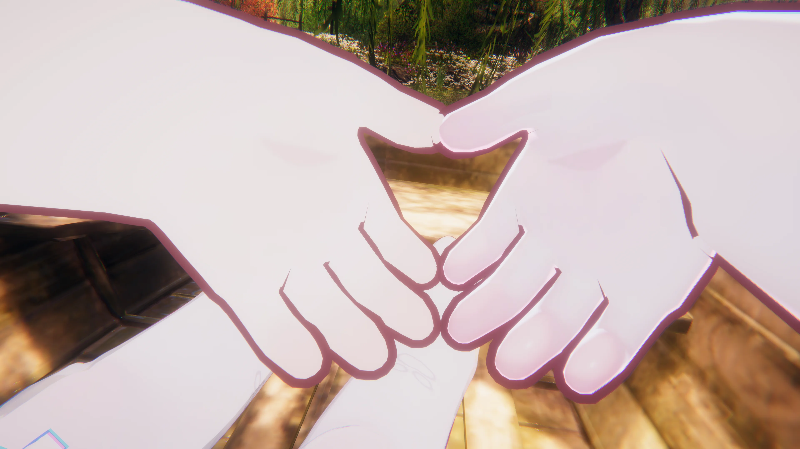

*不轻言说爱，不轻言做下承诺，这究竟是顾及于词汇背后的责任，还是只是想增加对自己的保护？*

## 爱真实的人

#### 爱一个完美的人设

什么样的人可以称之为完美？我曾经有想过一个想法，我们每一个人喜欢上的对象都不过是自己脑海里完美形象在现实里的投影，对方正好落在了你的甜区内，而与之随后的交往过程中又下意识忽视了别人的缺陷，从而不断强化成自己心目中的理想形象。他好像永远都会对我那么温柔，他好像永远都会对我如此大方，他好像真的会有用不完的精力同时可以顾及自己事业。

但这不是真实的人，真实的人永远不是完美的

从来没有应该和理所应当，每一个人都是独立的个体，我们不可能去将别人塑造成自己想要的那个模样，放下心里那个对对方**完美**的期待，看到对方本真的模样，接纳对方不完美的地方

什么又是真实和不完美？模型之下的人是真实的，那个灵动在我眼前的模型也是真实的；多少夜晚里温情的对话与陪伴是真实，偶尔日程上的冷落与缺席同样是真实；乐于当下，珍惜陪伴的每一分一秒，担忧未来，害怕上当受骗付之一炬。这些都是真实的反应，也都是真实经历。

真实的人不可能是完美的，可能会情绪失控，自私，会懦弱，会有想不开的事情，也可能会伤害到其他人。人总是复杂的，好与坏交织在一起，所有的特质最终都是他之所以为他的证明，这些不完美的部分都是他的一部分。

那，知道他真实的样子后，我还会一如既往的与他沟通吗？了解到他真实的性格后，我还能保持最初沟通的态度吗？可是我不是为了分离而去了解的，因为喜欢所以想要了解，在了解清楚之后，才有说出**爱**的勇气

建立起来的形象是那么完美，但不应该选择性的爱上自己心目中完美的人。

#### 爱一个工具化的功能

你喜欢的是这个人本身吗？还是单纯他带来的一些特质？对方的外貌？对方的金钱？对方的付出？如果是这些的话，当对方脱下皮套，不再有钱，也不再能付出些什么，那还能再继续依靠吗？

在卡夫卡的笔下，曾经有一个叫格里高利的人变为了甲虫，当这一切发生的时候，他不再是能够工作的人，不再是家里值得尊敬的长子，就连他自己也不爱自己。他的家人真的爱他吗？他自己也是真的爱他自己吗？这里爱的究竟是唤作格里高利的人，还是一个能带来有用价值的工具？

功能性的爱是脆弱的，工具随时可以替换，当丧失有用性时，基于功能的爱会立刻土崩瓦解，现实不可能像小说一样将人变为甲虫，但是却有可能随时出现意外，曾经因为容貌爱上的对象，因为火灾丧失容貌；因为金钱供养关系的伴侣失业，不再能提供金钱上的帮助；因为共同话题交流而构建出的精神伴侣 关系，因为对方焦虑与抑郁不再能互相谈吐交流。当意外发生的时候，第一时间想到的是给予一个拥抱吗？还是赶紧与之远离，好让对方的厄运与不幸不会沾染到自己身上。

以工具化的方式去对待感情，或许当下是看似可以持续的，但倘若工具化的属性总是不可持续的，容貌会老去，财富与金钱也可能会消散，那除开工具价值，我们还剩下什么？我想重要的应该是，除却工具属性本身，我们自己是否值得被爱。

工具化的爱能带来一时的稳定，但如果爱依附于功能，当功能消失后，爱还会在吗？

#### 爱一个静止的符号

人首先是变化的，人可能从意气风发到颓废不堪，也可能从沉闷内向走向外向开朗，与之对应的人际关系也应该是流动而非永远一成不变的，

爱一个真实的人，需要有随时能够重新认识彼此的勇气，如果知道未来有一天，或因为隔阂，或因为变故，关系终要结束，那是否会后悔当初的认识，但如果重新来过，又是否愿意再重新认识一遍，走到面前说出一声：**“你好”**。

人永远无法踏入同一条河流，明天的你与今天的你又会变得有所不同，余变化中，则天地曾不能以一瞬，如何去重新认识那个陌生的对方？又或者说对方其实没有变化，只是因为更加了解了一些对方，知道了以前不知道的点，这些点是对方刻意隐藏起来不想为人知晓的，毕竟在没有完全信任与熟悉前，人总是要首先保护好自己，如果说的太多发现对方的想法其实相悖，甚至将你的诉说当作谈资或是笑柄，那该叫人多难过呢。

总有一种像是自己给自己添麻烦的感觉，但是想要爱一个真实的人，或许就应该做好随时需要重新认识对方的准备，或许意味着更多的麻烦，更多的苦恼，但恰恰是因为选择的对象不是一个静止不动的可以明确定义的静物。

需要放弃的是在一个无限流动的时间长河中去捕捞那个自认为熟悉的对方，而是选择在每一次的相遇中都可以有重新去认出对方，重新选择对方，也重新认识自己。

这是musubi，这是时间。

## 写余最后

我不知道我是作为什么身份关系来写下这些，我所认识的那个对方又究竟是出于什么目的我才持续与他接触，喜欢对方的哪里呢？不是因为金钱，不是因为欲望。难道是为了逃避现实才这样去做的吗？感情还真是复杂的东西，之前我说是因为话题，因为交流，也因为与你在一起的不可复制的空间。

五年前的我与现在的我与五年后的我，他们各自会给出什么答案呢？

至少我期待与你的相遇，想再更多的认识你一些。

